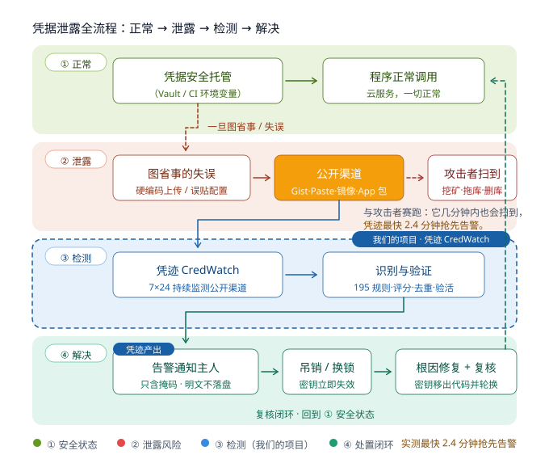
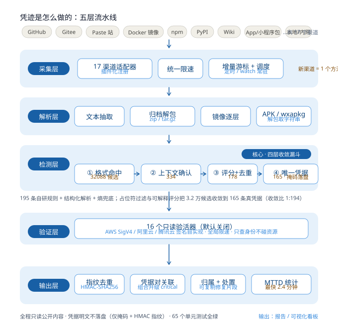

# 凭迹 CredWatch

> 云上凭据泄露自动化检测平台
> 面向"华为杯"第五届中国研究生网络安全创新大赛 · 揭榜挑战赛 · 题目3

## 这是什么

凭迹（CredWatch）是一套面向**防御目的**的凭据泄露监测平台。它持续扫描
公开渠道，发现其中暴露的云上凭据（AK/SK、访问令牌、数据库连接串、私钥等），
按"发现—确认—聚合—归属—披露"的完整闭环输出可执行结论。

核心目标：把凭据从"公开暴露"到"被责任主体感知"的时间窗口，
从行业常见的数天到数月，压缩到分钟级。

## 一图看懂：正常 → 泄露 → 检测 → 解决

<p align="center">
  
</p>

凭迹的价值 = 在"公开渠道"这个枢纽上与攻击者赛跑：
实测最快 **2.4 分钟**抢先告警（详见《测试报告》第八节 MTTD 实测）。

## 它是怎么做的：五层流水线

<p align="center">
  
</p>

采集 17 个公开渠道 → 解析（归档/镜像层/小程序包解包）→ 检测（194 条规则四层收敛，
3.2 万候选收敛到 165 条真凭据）→ 16 个只读验活器 → 输出指纹去重、凭据对关联、
归属识别、处置建议与 MTTD 统计。

## 三条设计底线

| 底线 | 具体做法 |
| --- | --- |
| **不做任何攻击** | 只读取公开可访问内容；不登录、不绕过鉴权、不越权、不利用任何泄露凭据 |
| **不成为新的泄露源** | 凭据只以掩码 + HMAC-SHA256 指纹落盘，明文仅短暂存在于内存且不参与序列化 |
| **不对第三方造成压力** | 所有渠道内置滑动窗口限速；活性验证默认关闭且仅调用只读身份查询接口 |

## 快速开始

```bash
# 1. 安装依赖
pip install -r requirements.txt

# 2. 真实数据演示（无需任何令牌，实时扫描 GitHub 公开 Gist）
#    报告中的每一条发现都来自真实公开渠道，凭据仅以掩码呈现
python -m credwatch demo            # 默认 120 个 Gist，约 2 分钟
python -m credwatch demo --gists 600 --rate-limit 180   # 大规模实测
# 无网络环境可用 python -m credwatch demo --offline 做管线自检

# 3. 查看渠道与规则库
python -m credwatch sources --health
python -m credwatch rules

# 4. 扫描本地 / 内网目录
python -m credwatch scan-local D:/projects/your-repo

# 5. 扫描在线渠道（先在 .env 中配置令牌）
cp .env.example .env
python -m credwatch scan --source github
python -m credwatch scan --all

# 6. 可视化看板
pip install streamlit
python -m credwatch serve

# 7. 进阶能力
python -m credwatch lint-rules     # 规则库自检
python -m credwatch bench          # 性能基准（可复现）
python -m credwatch new-source 新渠道  # 现场演示渠道扩展
python -m credwatch induce-rule --samples "前缀xxx,前缀yyy"  # 规则自动归纳
python -m credwatch feedback <指纹> --false-positive  # 误报标注
python -m credwatch calibrate      # 用标注样本校准评分权重
python -m credwatch verify         # 复核修复结果
```

报告输出在 `output/` 目录，包含 Markdown 报告、JSON 结果与 CSV 暴露明细。

## 能力概览

| 能力 | 规模 |
| --- | --- |
| 公开渠道 | 17 个，覆盖 11 个类别 |
| 检测规则 | 194 条 |
| 凭据大类 | 6 类 |
| 凭据类型 | 59 种 |
| 只读活性验证器 | 16 个（云签名自实现） |
| 凭据对关联类型 | 9 类（组合风险分析） |
| 可解释评分特征 | 19 维（支持权重自适应） |
| 上下文结构化提取 | DSN/配置解析为 host·port·username·database 信息对 |
| 报告形态 | Markdown + 自包含 HTML（可打印为 PDF） |

详细清单见：
- [`docs/支持的公开渠道列表.md`](docs/支持的公开渠道列表.md)（自动生成）
- [`docs/支持的凭据类型列表.md`](docs/支持的凭据类型列表.md)（自动生成）

## 工作流程

```
采集层  →  解析层  →  检测层  →  验证层  →  输出层
15 个渠道   文本/镜像/    规则+熵+    只读活性   指纹去重
            归档/小程序   上下文+结构   验证      跨渠道关联
                          化四层收敛             归属+披露建议
```

### 四层收敛（误报控制）

1. **格式命中**：194 条 YAML 规则 + 结构化解析 + 香农熵兜底
2. **占位符与关键词过滤**：剔除 `your_key_here`、`<TOKEN>`、`${ENV_VAR}` 等示例值
3. **上下文评分**：按变量名、文件路径、邻近关键词加权打分，阈值截断
4. **只读活性验证**：调用平台身份接口确认凭据是否仍然有效（默认关闭）

## 目录结构

```
credwatch/
├── config.py            配置与规则加载
├── models.py            数据模型（含掩码与指纹）
├── sources/             采集层：15 个渠道适配器 + 注册表
├── parsers/             解析层：文本抽取、归档解包、镜像层解包
├── detectors/           检测层：规则引擎、熵、结构化、可解释评分、流水线
├── validators/          验证层：16 个只读活性验证器
├── dedup.py             指纹去重与跨渠道关联
├── context_extract.py   上下文结构化提取（敏感信息对）
├── report_html.py       自包含 HTML 报告（可打印为 PDF）
├── correlation.py       凭据对关联（组合风险分析）
├── scoring.py           可解释概率评分 + 权重自适应
├── rule_induction.py    规则自动归纳
├── rule_lint.py         规则库自检
├── remediation.py       修复建议引擎
├── feedback.py          误报反馈闭环
├── benchmark.py         性能基准
├── scaffold.py          渠道脚手架生成
├── attribution.py       归属识别与披露建议
├── storage.py           SQLite 存储（不落明文）
├── scheduler.py         扫描引擎与增量游标
├── report.py            报告生成
├── dashboard.py         可视化看板
└── cli.py               命令行入口

config/rules/            194 条检测规则（7 个 YAML 文件）
scripts/                 实测、文档生成、规则维护脚本
docs/                    交付文档
tests/                   62 个单元测试
```

> 本项目不附带任何"演示凭据"文件：演示数据来自实时真实扫描
> （GitHub 公开 Gist），报告中凭据仅以掩码与 HMAC 指纹呈现。

## 测试

```bash
python -m unittest discover -s tests -t .
```

## 文档

| 文档 | 内容 |
| --- | --- |
| [`docs/技术说明书.md`](docs/技术说明书.md) | 架构设计、算法原理、模块实现 |
| [`docs/支持的公开渠道列表.md`](docs/支持的公开渠道列表.md) | 渠道清单与扩展方式 |
| [`docs/支持的凭据类型列表.md`](docs/支持的凭据类型列表.md) | 凭据类型与规则语法 |
| [`docs/合规与伦理声明.md`](docs/合规与伦理声明.md) | 合规边界、数据处理、负责任披露 |
| [`docs/引用与开源组件说明.md`](docs/引用与开源组件说明.md) | 原创性声明与参考来源 |
| [`docs/创新点说明.md`](docs/创新点说明.md) | 八个创新点及其验证方式 |
| [`docs/对比优势与基准.md`](docs/对比优势与基准.md) | 与同类工具的差异 + 性能基准 |
| [`docs/答辩演示脚本.md`](docs/答辩演示脚本.md) | 20 分钟答辩分镜与答疑预案 |
| [`docs/作品简介.md`](docs/作品简介.md) | 报名作品简介模板 |
| [`docs/测试报告.md`](docs/测试报告.md) | 单元/功能/性能/专项测试结果 |
| [`docs/参赛作品声明.md`](docs/参赛作品声明.md) | 原创性与非攻击性声明（提交前签名） |
| [`docs/赛题要求对照与自查表.md`](docs/赛题要求对照与自查表.md) | 逐项对照赛题要求 + 风险项与待办 |

## 免责声明

本平台仅用于**授权的安全研究、自有资产自查与学术竞赛**。
使用者应确保对检测目标拥有合法授权，并遵守《中华人民共和国网络安全法》
及相关法律法规与平台服务条款。发现他人凭据泄露时，应按负责任的披露
流程通知责任主体，不得进行任何形式的利用。
